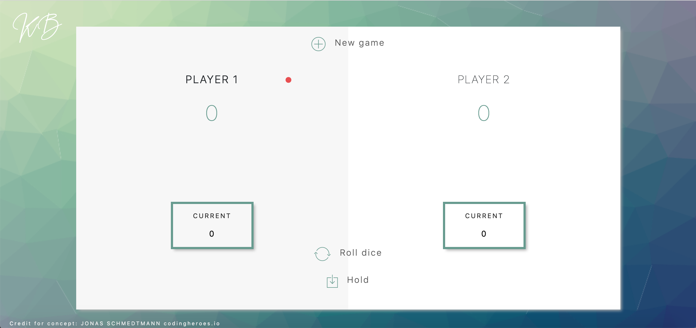

# Pig (Dice Game)

## Game Play

The game has 2 players, playing in rounds. In each turn, a player rolls a dice as many times as he wishes. Each result gets added to their round score. But, if the player rolls a 1, all of their round score gets lost. After that, it is the next player's turn. The player can choose to 'Hold', which means that their round score gets added to their global score. After that, it is the next player's turn. The first player to reach 100 points on the global score wins the game

